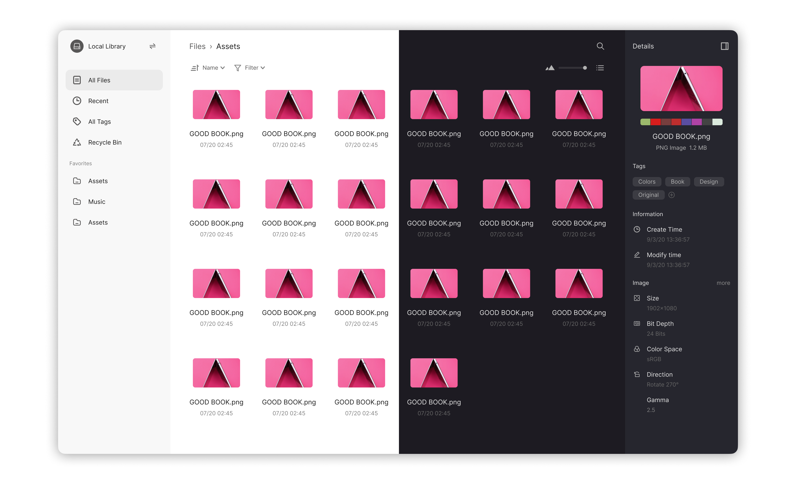

> This project is still in the early stages of development. All code, interfaces and features are unstable.

Digital asset organizing tool for creators.

## Features

- Full-featured file manager
- Preview support for text, images, audio, video, fonts, 3D, and more files.
- Powerful metadata mining and search feature.
- Can be installed as a local application or deployed as a cloud service.
- Cross-platform with high performance, using dotnet and web technologies.

[Roadmap](https://github.com/EYHN/Anything/wiki/Roadmap)

## Modules

This repository is a monorepo and contains the following modules.

### core

The backend of `Anything`, running on the `dotnet`.

Status: 

| Name                | Description                                                                                                                                                      | Status                                                            |
| ------------------- | ---------------------------------------------------------------------------------------------------------------------------------------------------------------- | ----------------------------------------------------------------- |
| Anything.FileSystem | Virtual File system abstraction, smoothing out file system differences in between platforms, and also allows for custom file system providers.                   |  |
| Anything.Database   | Provides storage interface based on sqlite, capable of storing file indexes, image cache, configuration files, etc.                                              |  |
| Anything.Preview    | Gets file types, icons, thumbnails and metadata from different formats of files.                                                                                 |  |
| Anything.Search     | Provide search interface for applications, including metadata mining and implementation of a search engine based on [Lucene.Net](https://lucenenet.apache.org/). |  |
| Anything.Server     | Provides interfaces for clients to access data. Using `graphql` to query data and using `http` to transfer images and files.                                     |  |

### web

A web client for anything, built with `react`.

Status: 

## Community

We will release information about project progress, news, and design in [Discussions](https://github.com/EYHN/Anything/discussions).

The official community language is English.

## Contribution

### Ideas

You can post your thoughts and ideas about this project in [Discussions](https://github.com/EYHN/Anything/discussions).

### Develop

#### Back-end

Anything's backend programming language is c#.

You can use `Vistual Studio`, `Vistual Studio Code`, `Github Codespace`, `JetBrains Rider` for development.

The project uses `StyleCop`, and the code needs to pass Roslyn code style analysis.

The project uses `NUnit` and all modules need to cover unit tests.

#### Front-end

The project uses `pnpm` as the package manager.

Clone this repository, run `pnpm install`, then run `pnpm run dev` for development.

### Design

We use `figma` for UI and icon design. You can find the latest design [from here](https://www.figma.com/file/j6B64U4ebq0nJsp6RDXfN2/Anything).

Or you can download the editable figma file [from here](./dls/Anything.fig).

## License
